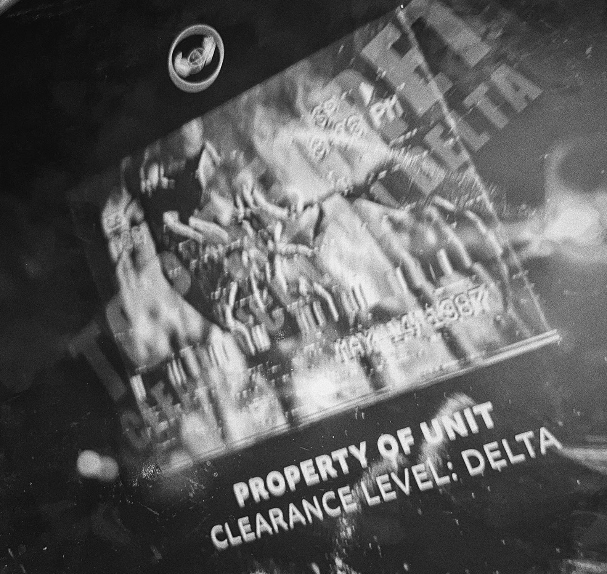
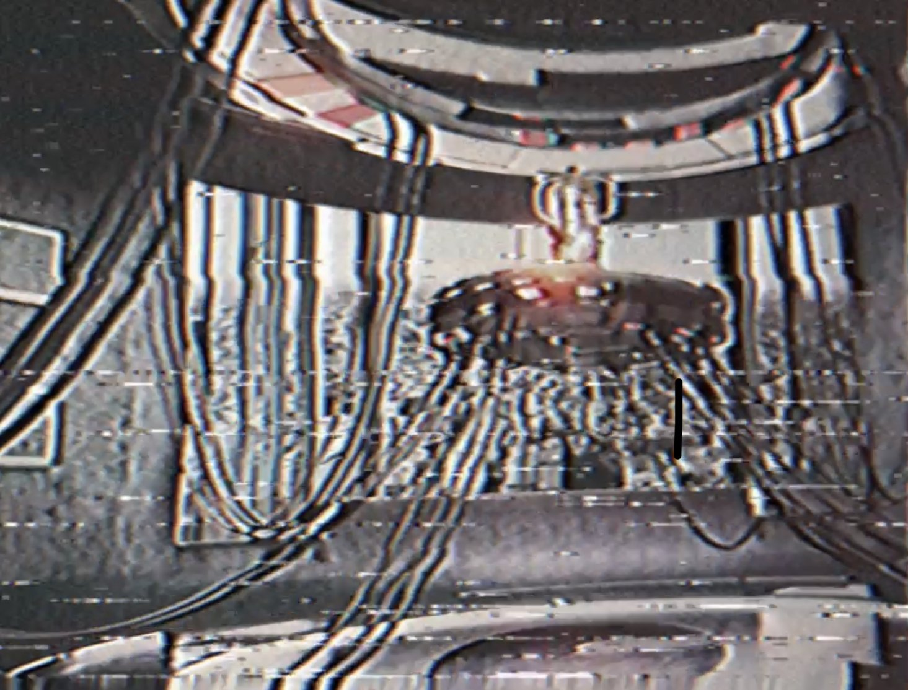
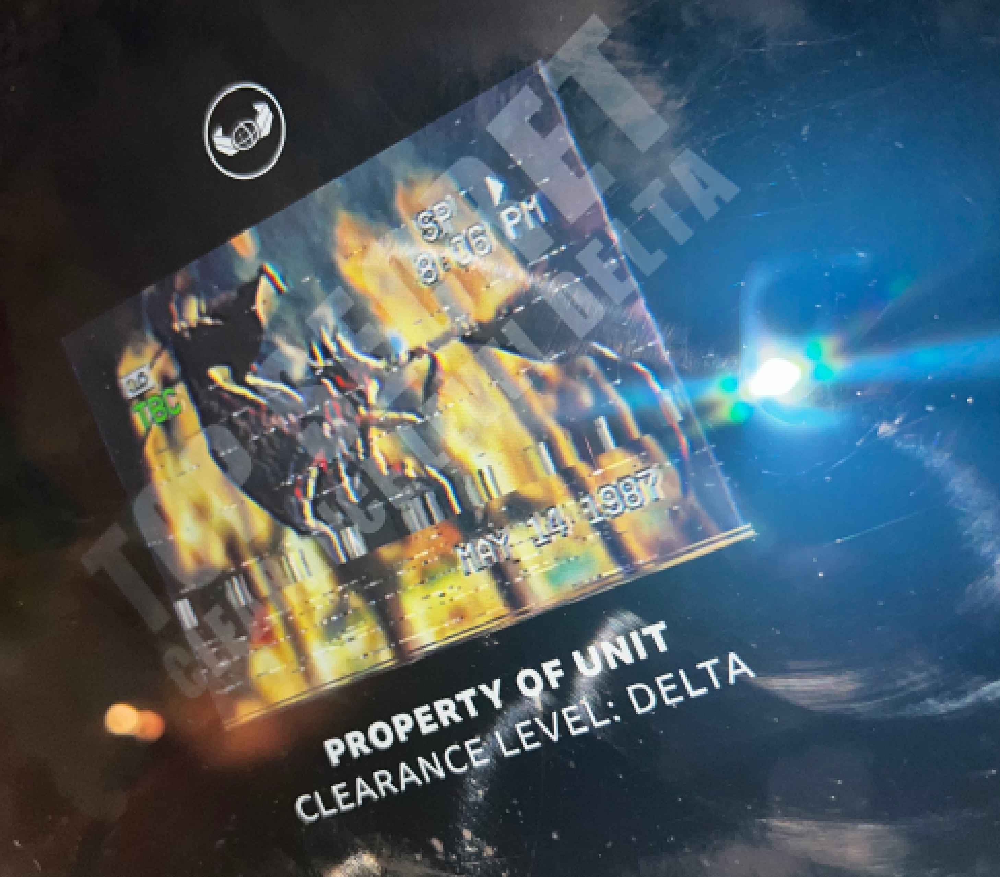

# Initial
Cybus Industries starts tweeting on July 27th

On July 31st, they [tweeet](https://twitter.com/CybusIndus/status/1553471117553061888) a travel promo. Two QR Codes in this image link to 

    https://www.camdenmarket.com/shops/cyberdog

A bar, and

    https://qrco.de/bdDEya

A classified UNIT image

</img>

# Clues
* [Clue 1](#clue-1---august-4th)
* [Clue 2](#clue-2----august-7th)
* [Clue 3](#clue-3---august-8th)
* [Clue 4](#clue-4---august-9th)
* [Clue 5](#clue-5---august-9th)
* [Clue 6](#clue-6---august-10th)
* [Clue 7](#clue-7---august-11th)
* [Clue 8](#clue-8---august-11th)
* [Clue 9](#clue-9---august-11th)
* [Clue 10](#clue-10---august-12th)
* [Clue 11](#clue-11---august-12th)
* [Clue 12]()
## Clue 1 - August 4th
Cybus tweet about a security breach. The following image is tweeted

The text contained is

    68 74 74 70 73 3a 2f 2f 71 72 63 6f 2e 64 65 2f 62 64 44 71 76 51

This can be decoded from hexadecimal to a [link](https://qrco.de/bdDqvQ)

That page hosts the following image, an email from Keith Simpson (Head of Digital Security) to Steven Crest (CEO)

This email features an attachment that isn't fully legible, 'full_colour_cctv_leak.jpg', and an encryption key at the bottom

    73 68 6f 72 74 75 72 6c 2e 61 74 2f 46 4e 52 54 55

This decodes from hexadecimal to a (now defunct) [link](shorturl.at/FNRTU)

That link had the colour cctv image

</img>

## Clue 2  - August 7th
Cybus Industries release a [video statement](https://www.youtube.com/watch?v=SYJk3hEI-3c) about the tragic death of Magpie, who fell out of a window following his plan to buy the company

In this video, the word 'parakeet' is seen in the corner of a section

This can be appended to the Cybus website

    https://cybusindustries.org/parakeet

This page contains the following image, named 'CONTROL.png'

It also contains a link to the security logon page

    https://cybusindustries.org/security/

With the following information:

username: tarker_naomi01\
password: xxxxxxxxxx

Naomi Tarker was revealed to be an alias of Steff Porter, and Ex-Employee, in the previous clue

## Clue 3 - August 8th
Cybus tweets, then deleted, the following

_Note: The following is from another twitter account, preserving the text of the second deleted tweet_

The first tweet contains the text
    66 61 74 61 6c 5f 73 79 73 74 65 6d 5f 65 72 72 6f 72

Which decodes from hexadecimal to be

    fatal_system_error

This can be added into the URL from the image in clue 2, 

    https://cybusindustries.org/wp-content/uploads/2022/08/FILENAME.png

to become

    https://cybusindustries.org/wp-content/uploads/2022/08/fatal_system_error.png

Which is

This image contains a faint overlay of an email from Crest to Simpson, discussing Simpsons failure as head of digital security. There is also mention of a second encryption key

    B&E)H@McQfTjWmZq

The second tweet contains the text

    G5+sNrgMWpPYU4LKLiRy1g==

Keys are used in a wide range of encyption, an obvious form being AES. Using the key & text given in this clue, the text is decrypted to base64, then plain text, revealing

    the_C

Using the security information revealed in Clue 2, the password is now

    the_CXXXXX

This is confirmed by Steff Porter

## Clue 4 - August 9th
Cybus tweets a promotion for their upgrade, urging viewers to get Beach Ready

The top-right corner of the image contains the text 'seagull', as well as a Seagull on the Cybermans shoulder

This can then be added to the Cybus website

    https://cybusindustries.org/seagull/

This page contains another image

## Clue 5 - August 9th
Cybus tweets a link to buy their Exosuit figurines
    http://cybusindustries.org/figures

Clicking the Add To Basket button takse you to the following

    http://cybusindustries.org/woodpecker

That contains the following image

The Return Policy links to an unlisted YouTube video called [help help](https://www.youtube.com/watch?v=G8zASalF2mA)

### Help Help
There are several things in this video
#### Tags
The description of the video says to check the tags. This can be done using Inspect Element, to inspect the 'head' element of the webpage, specifically the 'keywords' meta tag

This says

    Encryption key, G5+sNrgMWpPYU4LKLiRy1g==, l8Tw5CYnLtyRI6rXd1YUSA==

The first weird string is one we have seen before, in Clue 3 to reveal the first portion of the password. The second one is new

#### Audio
By reversing the video, which can be found [here](https://www.youtube.com/watch?v=SHiKM2L45vQ)

The audio becomes understandable. 

> Help\
I dont have much time\
They are attempting to trace my illiegal satelite system\
They are hacking new eyes to search on the ground
re routing (btm trap?) delayed them good one.\
Listen\
I already have leaked the systems encryption key\
I have already leaked the first encryption of the password\
The second portion is as follows:\
l8Tw5CYnLtyRI6rXd1YUSA==  (separated by dots?)
More will follow. We can talk then.\
Help. Help.

### Decrypting
Using the encryption key from Clue 3, B&E)H@McQfTjWmZq, the new string can be decoded via AES to base64 and plain text

    anary_

Adding this to the password we have already gives us

    the_Canary_

This is the ten characters hinted at in Clue 2

## Clue 6 - August 10th
Steff posts a (now defunct) link to an online jigsaw puzzle. Assembling it reveals more leaked emails

</img>

This is from Crest to Stephanie Sullivan, the new Head of Digital Security. He is warning her that she will be fired if these hacks and leaks continue. 

This email mentions that there is 8 characters added to passwords for security reasons.

## Clue 7 - August 11th
Cybus Industries [tweet](https://twitter.com/CybusIndus/status/1557471359336386560) an image of an article about UNIT being replaced by CybusDefence. 

</img>

There are pigeons edited into the image, which fits the theme of looking for birds for clues. Steff also tweets in reply, a collation of 'prize' images and associated hashtags, including #pigeon

This can be added to the Cybus website

    https://cybusindustries.org/pigeon/

This inclues another image, this image has the word 'S i n' on it

## Clue 8 - August 11th
Cybus tweets (now deleted) the following

The text 'mockingbird' in this can be added to the Cybus website

    https://cybusindustries.org/mockingbird

This contains another image

There is also a password protected video

### Mockingbird Video
Steff (tweets)[https://twitter.com/SteffPorterC/status/1557493210506825728?cxt=HHwWgMC8hdb0qZ0rAAAA]

Taken with the tag of 'Sin', and the mockingbird clue, this refers to the quote 'It's a sin to kill a mockinbird'. The sin in this, is to kill a mockingbird. This phrase is the password for the video

    tokillamockinbird

The video contains audio which needs to be reversed. This can be found here

The transcript

>Mockingbirds don't do one thing but make music for us to enjoy.\
They don't eat up people's gardens, don't nest in corncribs, they don't do one thing but sing their hearts out for us.\
That's why it's a sin to kill a mockingbird.\
You have them scared, you are close, they will come for you, you must be quick, the third portion of the encrypted password is here, find it before it is too late.

Within the video, there are flashes of characters in red. The video needs to be rotated 180 degrees, and played in reverse, to get the following characters

    Kplk6

When this is fed through a Caesar Cipher with a shift of 19, the decoding reveals

    Died6

## Clue 9 - August 11th
Cybus [tweet](https://twitter.com/CybusIndus/status/1557683734077489152) an announcement of their streaming service, Cybus Broadcasting Network. 

There is a peacock in the center of the logo. This is another bird which can be added to the Cybus website

    https://cybusindustries.org/peacock/

Shortly after this, they [tweet](https://twitter.com/CybusIndus/status/1557704833393741827) a high resolution promo image for The Late Late Show With Craig Owens

Steff [replies](https://twitter.com/SteffPorterC/status/1557714286486724610) to this image with a vandalised one

This image has a string of numbers running across Craigs neck, and throughout the background

    74696d65206973207469636b696e672e20746865206d6f636b696e676269726420636f646520697320686572652e20

This can be decoded from hexadecimal to be

    time is ticking. the mockingbird code is here. 

The necessary code is somewhere in the image. 

By zooming in on both Craig images, the Cybus and Steff versions, a code can be seen on his shirt

_Note: This image has been rotated to be more readable_

The text here is the same code seen in Clue 8

    Kplk6

Which can be shifted 19 places to

    Died6

This clue was likely released to aid in the previous Clue, given the difficulty of solving it.

Steff tweets that there are 3 characters remaining, the reemaining 3 in the security code in the password

## Clue 10 - August 12th
Cybus [tweets](https://twitter.com/CybusIndus/status/1557851793018613760) an advertisement for its Cyber Leaders program with a link

    https://cybusindustries.org/cyberleaders/

There is an application form, which when filled out sends you an email including an attachment

This is a screenshot of an email from Crest to a Jamal Bennett, an employee involved in organising the UNIT handover process. They include an image in the screenshot of an 'animal' similar to what is being contained in facilities worldwide.

The name of this image can be added to the usual image URL

_NOTE: The image in the email says jpg. The actual file is a png_

    https://cybusindustries.org/wp-content/uploads/2022/08/unit_archive_creature.png

</img>

The email also contains an encyption key

    00 74 00 69 00 6e 00 79 79 00 75 00 72 00 6c 00 00 2e 00 63 00 6f 00 6d 00 2f 00 32 00 70 00 39 00 65 00 7a 00 65 00 68 00 61

This decodes from hexadecimal to

    tinyyurl.com/2p9ezeha

The 00s throughout the text can be removed, they do not impact the decrypted text.

This URL leads to a document from Oklahoma State University abotu birds

    https://okstateornithology.files.wordpress.com/2011/01/ornithology-lab-1.pdf

There are many birds in here, but the Sparrow gets several mentions. In addition, on the Cyber Leaders page the first letter of each paragraph in the "What Does It Take" section spell out SPARROW

This can be added to the Cybus website

    https://cybusindustries.org/sparrow/

Which contains another image

## Clue 11 - August 12th
Steff [tweets](https://twitter.com/SteffPorterC/status/1557876622233059331) a video of her in the woods, followed by a loud noise similar to a Cyberman stomping

And [replies](https://twitter.com/SteffPorterC/status/1557876721235513346) to this, 'forgive my sins'

Shortly after, Cybus has their twitter account hacked and tweets (now deleted)

</img>

The account also tweets (now deleted) a link to an unlisted [youtube video](https://www.youtube.com/watch?v=FfAthsM_78U&), the same as the video Steff uploaded

The video title

    6920636f6d6d697474656420612063617264696e616c2073696e206920616d20736f727279

decodes from hex to

    i committed a cardinal sin i am sorry

Cardinal is a type of bird seen in the file from Clue 10. There is no cardinal page, however. The tweet to 'follow the north star', and several mentions of 'northern' in the images are hints to the Northern Cardinal, which is a bird from that document

Adding northerncardinal to the Cybus website

    https://cybusindustries.org/northerncardinal/

Loads a page with another image

Thish as the text 'lifeless' and 'A W' imposed onto it

The page also links to another unlisted [YouTube video](https://www.youtube.com/watch?v=VQLSfKfLwUE)

### Cardinal Video
This is another reversed video. A reversed version, playing 'forward' can be seen [here](https://www.youtube.com/watch?v=_xT7Lf3IPa8)

Transcribed:

>if you don't work you have no right to eat\
And instead we need to have a different attitude to our mistakes and to our misdeeds.\
Walt Whitman always admired animals because they do not lie awake at night and weep for their sins. Animals are practical in the real sense as are children\
The first thing to understand is that it is not a serious failing in a human being to make mistakes. Everybody has to make mistakes.

# Other Information
## Cybus Industries Staff
### Steven Crest
Position: CEO, Cybus Industries\
Email: s.crest01@cybusindustries.org\
Status: Alive
### Keith Simpson
Position: (Former) Head of Digital Security, replaced by Stephanie Sullivan\
Email: keith.simpson@cybusindustries.org\
Status: Missing.
### Stephanie Sullivan
Position: (Former) Head of Digital Security\
Email: stephanie.sullivan@cybusindustries.org\
Status: Missing.
### Jamal Bennett
Position: UNIT Handover\
Email: jamal.bennett@cybusindustries.org\
Status: Alive
## Other Important People
### Elon Magpie
Occupation: Tech Genius, founder of Magpie Electronics\
Context: Wanted to buyout Cybus\
Status: Deceased after 'falling' throgh a window
### John Simmonds
Occupation: Author\
Instagram: [@johnsimmonds67](https://instagram.com/johnsimmonds67)\
Status: Alive
### Steff Porter
Occupation: Ex-Cybus employee, helpful ally on Twitter\
Context: Provides leaked information via Twitter [@steffPorterC](https://twitter.com/SteffPorterC)
Alias: Naomi Tarker\
Username: tarker_naomi01
Status: Abducted by Cybus

## FUTURE
A Discord user somehow got 
    https://cybusindustries.org/securitymainframe/
to load without a password

This page is new.
Following this, the previous security page has updated to just be a password form.
The Mainframe had a timer counting down

The mainframe had the Cybus logo, but now has the Preachers logo, and the image is called Teamwork

## Clearance Level Delta Materials

From the Travel promo

From the leadership email

