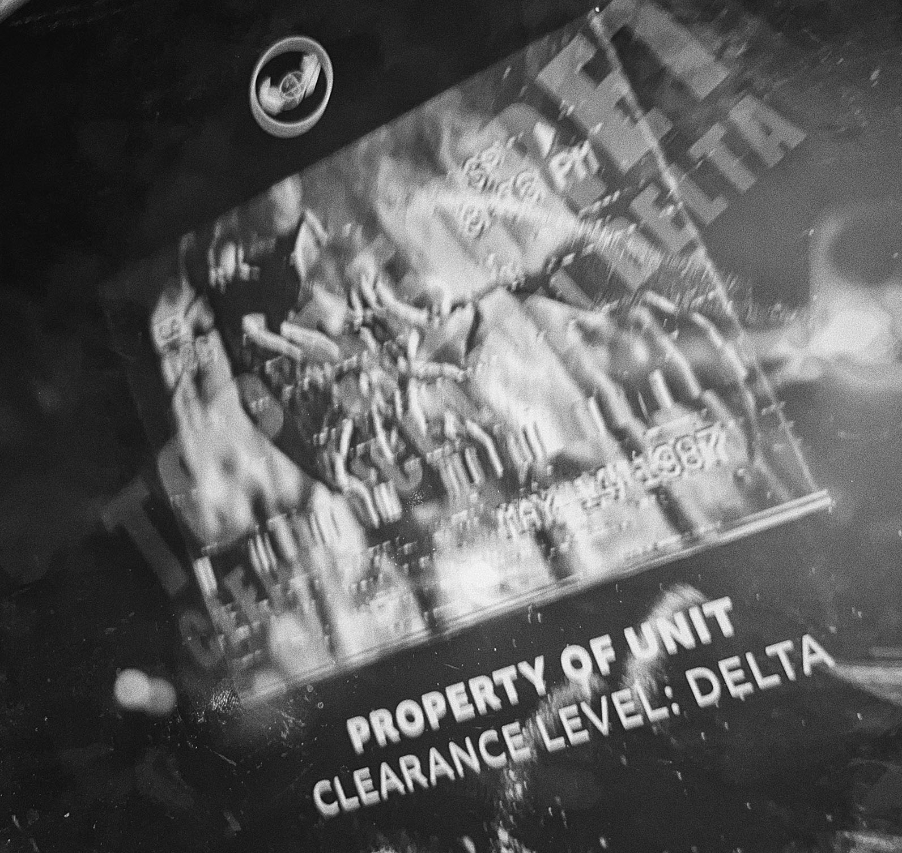
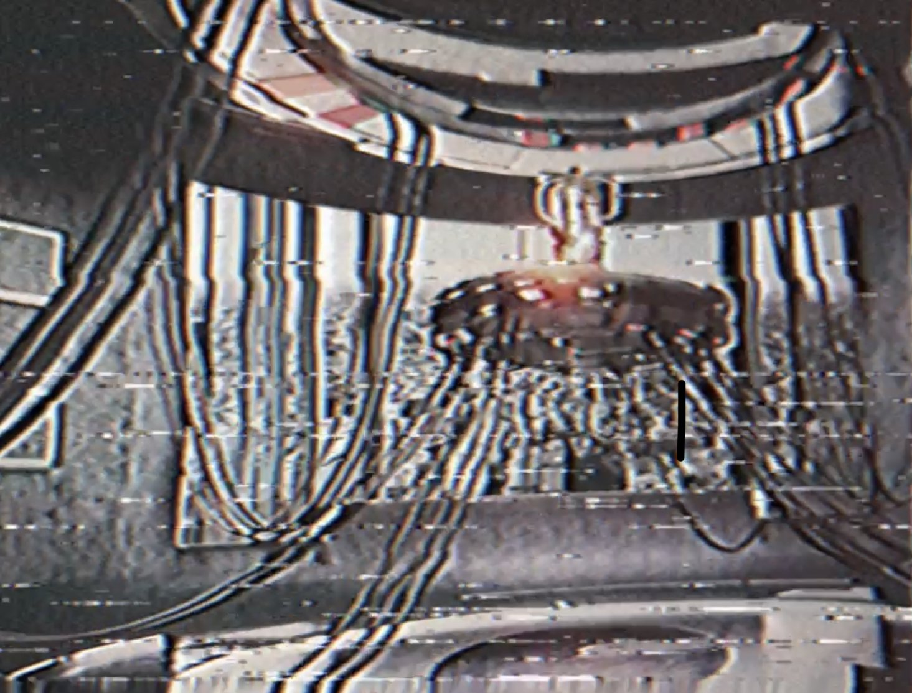
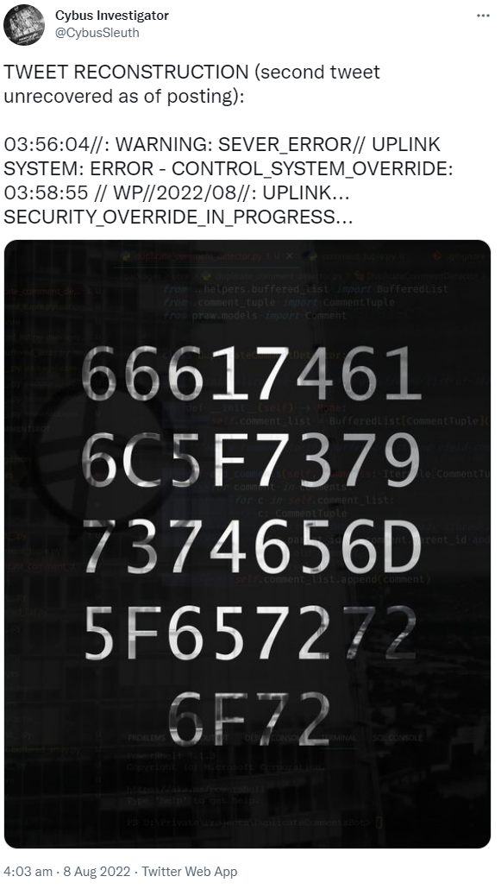
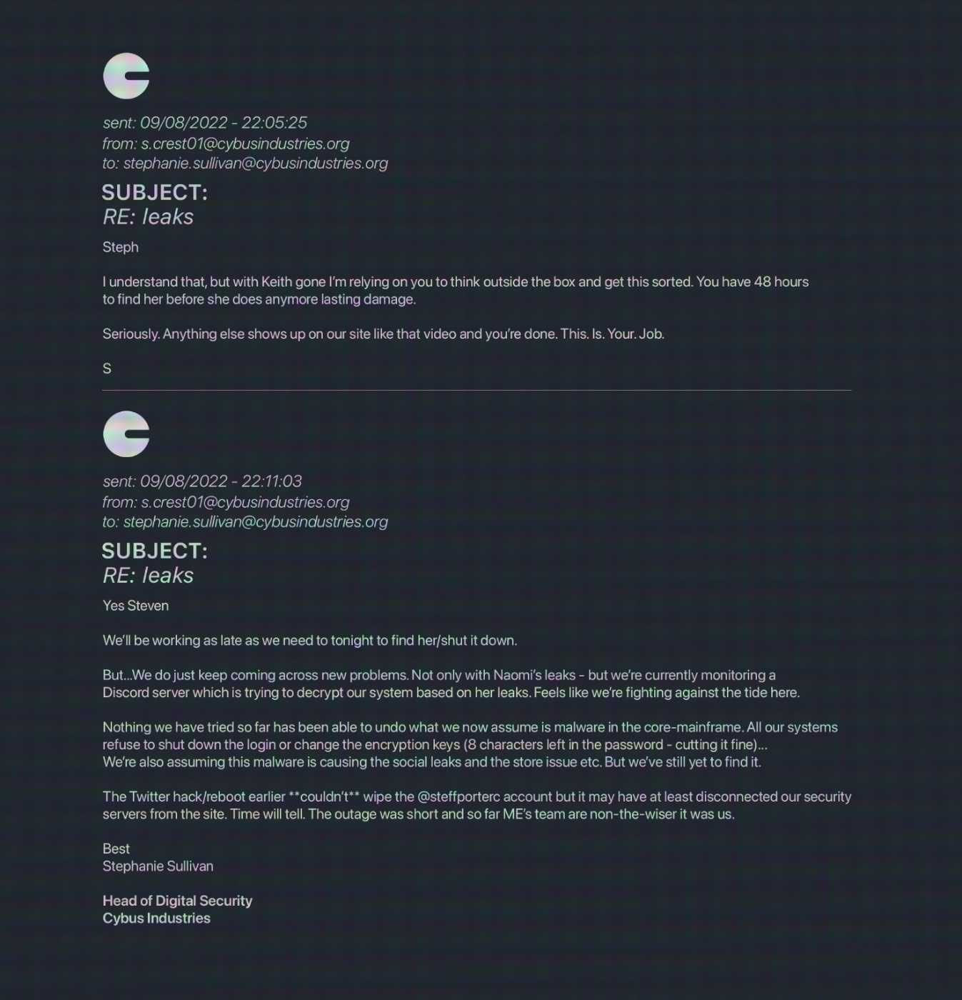
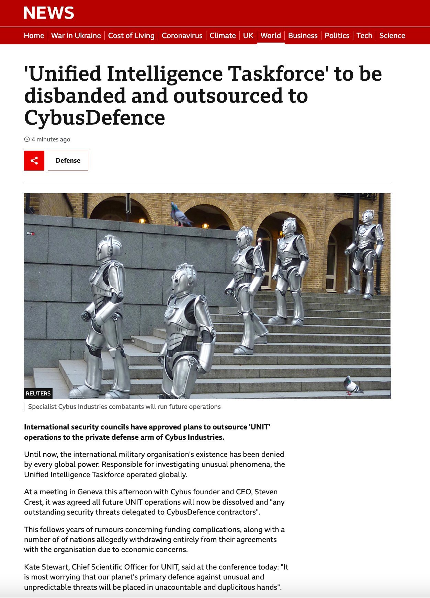
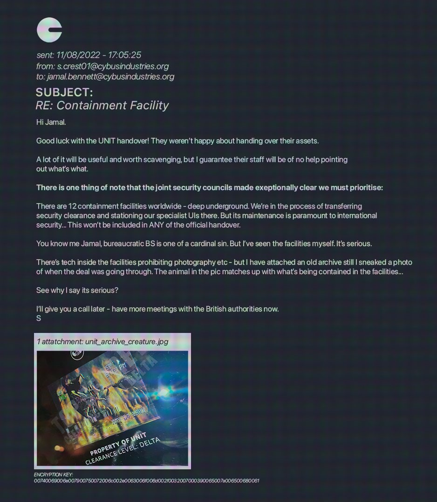
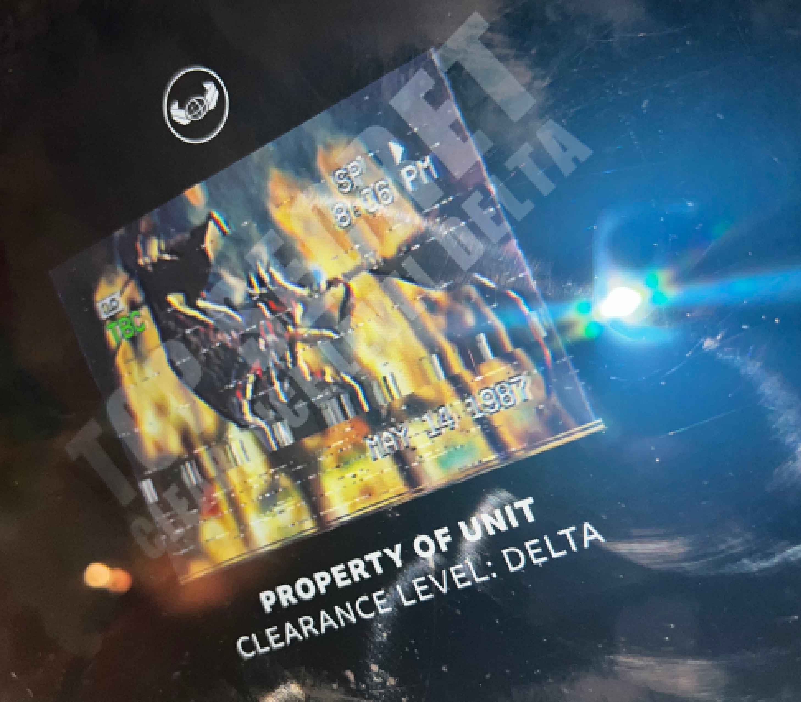
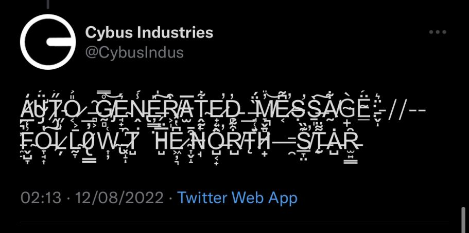

# Table of Contents
* [Act I](#act-i)
* [Act II](#act-ii)
* [Useful ingame information](#other-information)
* [Useful Information outside of the game]($meta-information)

_Some images have been resized on this page to make the page more readable. You can open the image in a new tab to view it at the full size_
# Initial
Cybus Industries starts tweeting on July 27th

On July 31st, they [tweet](https://twitter.com/CybusIndus/status/1553471117553061888) a travel promo. Two QR Codes in this image link to 

    https://www.camdenmarket.com/shops/cyberdog

A bar, and

    https://qrco.de/bdDEya

A classified UNIT image

# Act I

## Clues
* [Clue 1](#clue-1---august-4th)
* [Clue 2](#clue-2----august-7th)
* [Clue 3](#clue-3---august-8th)
* [Clue 4](#clue-4---august-9th)
* [Clue 5](#clue-5---august-9th)
* [Clue 6](#clue-6---august-10th)
* [Clue 7](#clue-7---august-11th)
* [Clue 8](#clue-8---august-11th)
* [Clue 9](#clue-9---august-11th)
* [Clue 10](#clue-10---august-12th)
* [Clue 11](#clue-11---august-12th)
* [Clue 12](#clue-12---security-mainframe)
* [Clue 13](#clue-13---august-15th)
* [Clue 14](#clue-14---august-16th)
* [Clue 15](#clue-15---august-17th)
* [Breakout](#breakout)
### Clue 1 - August 4th
Cybus tweet about a security breach. The following image is tweeted

The text contained is

    68 74 74 70 73 3a 2f 2f 71 72 63 6f 2e 64 65 2f 62 64 44 71 76 51

This can be decoded from hexadecimal to a [link](https://qrco.de/bdDqvQ)

That page hosts the following image, an email from Keith Simpson (Head of Digital Security) to Steven Crest (CEO)

This email features an attachment that isn't fully legible, 'full_colour_cctv_leak.jpg', and an encryption key at the bottom

    73 68 6f 72 74 75 72 6c 2e 61 74 2f 46 4e 52 54 55

This decodes from hexadecimal to a (now defunct) [link](shorturl.at/FNRTU)

That link had the colour cctv image

This image can also be found using the filename in the email

    https://cybusindustries.org/wp-content/uploads/2022/08/full_colour_cctv_leak.jpg

### Clue 2  - August 7th
Cybus Industries release a [video statement](https://www.youtube.com/watch?v=SYJk3hEI-3c) about the tragic death of Magpie, who fell out of a window following his plan to buy the company

In this video, the word 'parakeet' is seen in the corner of a section

This can be appended to the Cybus website

    https://cybusindustries.org/parakeet

This page contains the following image, named 'CONTROL.png'

This image can be seen on the website at

    https://cybusindustries.org/wp-content/uploads/2022/08/CONTROL.png

It also contains a link to the security logon page

    https://cybusindustries.org/security/

With the following information:

username: tarker_naomi01\
password: xxxxxxxxxx

Naomi Tarker was revealed to be an alias of Steff Porter, and Ex-Employee, in the previous clue

### Clue 3 - August 8th
Cybus tweets, then deleted, the following

_Note: The following is from another twitter account, preserving the text of the second deleted tweet_

The first tweet contains the text
    66 61 74 61 6c 5f 73 79 73 74 65 6d 5f 65 72 72 6f 72

Which decodes from hexadecimal to be

    fatal_system_error

This can be added into the URL from the image in clue 2, 

    https://cybusindustries.org/wp-content/uploads/2022/08/FILENAME.png

to become

    https://cybusindustries.org/wp-content/uploads/2022/08/fatal_system_error.png

Which is

This image contains a faint overlay of an email from Crest to Simpson, discussing Simpsons failure as head of digital security. There is also mention of a second encryption key

    B&E)H@McQfTjWmZq

The second tweet contains the text

    G5+sNrgMWpPYU4LKLiRy1g==

Keys are used in a wide range of encyption, an obvious form being AES. Using the key & text given in this clue, the text is decrypted to base64, then plain text, revealing

    the_C

Using the security information revealed in Clue 2, the password is now

    the_CXXXXX

This is confirmed by Steff Porter

### Clue 4 - August 9th
Cybus tweets a promotion for their upgrade, urging viewers to get Beach Ready

The top-right corner of the image contains the text 'seagull', as well as a Seagull on the Cybermans shoulder

This can then be added to the Cybus website

    https://cybusindustries.org/seagull

This page contains another image

### Clue 5 - August 9th
Cybus tweets a link to buy their Exosuit figurines
    http://cybusindustries.org/figures

Clicking the Add To Basket button takse you to the following

    http://cybusindustries.org/woodpecker

That contains the following image

The Return Policy links to an unlisted YouTube video called [help help](https://www.youtube.com/watch?v=G8zASalF2mA)

#### Help Help
There are several things in this video
##### Tags
The description of the video says to check the tags. This can be done using Inspect Element, to inspect the 'head' element of the webpage, specifically the 'keywords' meta tag

This says

    Encryption key, G5+sNrgMWpPYU4LKLiRy1g==, l8Tw5CYnLtyRI6rXd1YUSA==

The first weird string is one we have seen before, in Clue 3 to reveal the first portion of the password. The second one is new

##### Audio
By reversing the video, which can be found [here](https://www.youtube.com/watch?v=SHiKM2L45vQ)

The audio becomes understandable. 

> Help\
I dont have much time\
They are attempting to trace my illiegal satelite system\
They are hacking new eyes to search on the ground
re routing (btm trap?) delayed them good one.\
Listen\
I already have leaked the systems encryption key\
I have already leaked the first encryption of the password\
The second portion is as follows:\
l8Tw5CYnLtyRI6rXd1YUSA==  (separated by dots?)
More will follow. We can talk then.\
Help. Help.

#### Decrypting
Using the encryption key from Clue 3, B&E)H@McQfTjWmZq, the new string can be decoded via AES to base64 and plain text

    anary_

Adding this to the password we have already gives us

    the_Canary_

This is the ten characters hinted at in Clue 2

### Clue 6 - August 10th
Steff posts a (now defunct) link to an online jigsaw puzzle. Assembling it reveals more leaked emails

</img>

This is from Crest to Stephanie Sullivan, the new Head of Digital Security. He is warning her that she will be fired if these hacks and leaks continue. 

This email mentions that there is 8 characters added to passwords for security reasons.

### Clue 7 - August 11th
Cybus Industries [tweet](https://twitter.com/CybusIndus/status/1557471359336386560) an image of an article about UNIT being replaced by CybusDefence. 

There are pigeons edited into the image, which fits the theme of looking for birds for clues. Steff also tweets in reply, a collation of 'prize' images and associated hashtags, including #pigeon

This can be added to the Cybus website

    https://cybusindustries.org/pigeon/

This inclues another image, this image has the word 'S i n' on it

### Clue 8 - August 11th
Cybus tweets (now deleted) the following

The text 'mockingbird' in this can be added to the Cybus website

    https://cybusindustries.org/mockingbird

This contains another image

There is also a password protected video

#### Mockingbird Video
Steff (tweets)[https://twitter.com/SteffPorterC/status/1557493210506825728?cxt=HHwWgMC8hdb0qZ0rAAAA]

Taken with the tag of 'Sin', and the mockingbird clue, this refers to the quote 'It's a sin to kill a mockinbird'. The sin in this, is to kill a mockingbird. This phrase is the password for the video

    tokillamockinbird

The video contains audio which needs to be reversed. This can be found here

The transcript

>Mockingbirds don't do one thing but make music for us to enjoy.\
They don't eat up people's gardens, don't nest in corncribs, they don't do one thing but sing their hearts out for us.\
That's why it's a sin to kill a mockingbird.\
You have them scared, you are close, they will come for you, you must be quick, the third portion of the encrypted password is here, find it before it is too late.

Within the video, there are flashes of characters in red. The video needs to be rotated 180 degrees, and played in reverse, to get the following characters

    kplk6

When this is fed through a Caesar Cipher with a shift of 19, the decoding reveals

    died6

### Clue 9 - August 11th
Cybus [tweet](https://twitter.com/CybusIndus/status/1557683734077489152) an announcement of their streaming service, Cybus Broadcasting Network. 

There is a peacock in the center of the logo. This is another bird which can be added to the Cybus website

    https://cybusindustries.org/peacock

Shortly after this, they [tweet](https://twitter.com/CybusIndus/status/1557704833393741827) a high resolution promo image for The Late Late Show With Craig Owens

Steff [replies](https://twitter.com/SteffPorterC/status/1557714286486724610) to this image with a vandalised one

This image has a string of numbers running across Craigs neck, and throughout the background

    74696d65206973207469636b696e672e20746865206d6f636b696e676269726420636f646520697320686572652e20

This can be decoded from hexadecimal to be

    time is ticking. the mockingbird code is here. 

The necessary code is somewhere in the image. 

By zooming in on both Craig images, the Cybus and Steff versions, a code can be seen on his shirt

_Note: This image has been rotated to be more readable_

The text here is the same code seen in Clue 8

    kplk6

Which can be shifted 19 places to

    died6

This clue was likely released to aid in the previous Clue, given the difficulty of solving it.

Steff tweets that there are 3 characters remaining, the reemaining 3 in the security code in the password

### Clue 10 - August 12th
Cybus [tweets](https://twitter.com/CybusIndus/status/1557851793018613760) an advertisement for its Cyber Leaders program with a link

    https://cybusindustries.org/cyberleaders/

There is an application form, which when filled out sends you an email including an attachment

This is a screenshot of an email from Crest to a Jamal Bennett, an employee involved in organising the UNIT handover process. They include an image in the screenshot of an 'animal' similar to what is being contained in facilities worldwide.

The name of this image can be added to the usual image URL

_NOTE: The image in the email says jpg. The actual file is a png_

    https://cybusindustries.org/wp-content/uploads/2022/08/unit_archive_creature.png

The email also contains an encyption key

    00 74 00 69 00 6e 00 79 79 00 75 00 72 00 6c 00 00 2e 00 63 00 6f 00 6d 00 2f 00 32 00 70 00 39 00 65 00 7a 00 65 00 68 00 61

This decodes from hexadecimal to

    tinyyurl.com/2p9ezeha

The 00s throughout the text can be removed, they do not impact the decrypted text.

This URL leads to a document from Oklahoma State University abotu birds

    https://okstateornithology.files.wordpress.com/2011/01/ornithology-lab-1.pdf

There are many birds in here, but the Sparrow gets several mentions. In addition, on the Cyber Leaders page the first letter of each paragraph in the "What Does It Take" section spell out SPARROW

This can be added to the Cybus website

    https://cybusindustries.org/sparrow

Which contains another image

### Clue 11 - August 12th
Steff [tweets](https://twitter.com/SteffPorterC/status/1557876622233059331) a video of her in the woods, followed by a loud noise similar to a Cyberman stomping

And [replies](https://twitter.com/SteffPorterC/status/1557876721235513346) to this, 'forgive my sins'

Shortly after, Cybus has their twitter account hacked and tweets (now deleted)

\

The account also tweets (now deleted) a link to an unlisted [youtube video](https://www.youtube.com/watch?v=FfAthsM_78U&), the same as the video Steff uploaded

The video title

    6920636f6d6d697474656420612063617264696e616c2073696e206920616d20736f727279

decodes from hex to

    i committed a cardinal sin i am sorry

Cardinal is a type of bird seen in the file from Clue 10. There is no cardinal page, however. The tweet to 'follow the north star', and several mentions of 'northern' in the images are hints to the Northern Cardinal, which is a bird from that document

Adding northerncardinal to the Cybus website

    https://cybusindustries.org/northerncardinal

Loads a page with another image

Thish as the text 'lifeless' and 'A W' imposed onto it

The page also links to another unlisted [YouTube video](https://www.youtube.com/watch?v=VQLSfKfLwUE)

#### Cardinal Video
This is another reversed video. A reversed version, playing 'forward' can be seen [here](https://www.youtube.com/watch?v=_xT7Lf3IPa8)

Transcribed:

>if you don't work you have no right to eat\
And instead we need to have a different attitude to our mistakes and to our misdeeds.\
Walt Whitman always admired animals because they do not lie awake at night and weep for their sins. Animals are practical in the real sense as are children\
The first thing to understand is that it is not a serious failing in a human being to make mistakes. Everybody has to make mistakes.

These are quotes from poet Alan Watts. Alan Watts has a quote about lifelessness,

    The more a thing tends to be permanent, the more it tends to be lifeless

This focus on Alan Watts leads to a page on the website

    https://cybusindustries.org/alanwatts

Which features an image of Watts with a portion of the wikiedia article

This page also included a link, clicking it would prompt you to tweet a link to a tweet of the lifeless quote

The page was later updated to include a YouTube [video](https://www.youtube.com/watch?v=FBW453TvSeg) called 'purge', and a [link](https://twitter.com/AlanWattsDaily/status/1495260078974377987) to another quote by Watts

#### Purge
This is another video that needs to be reversed

Reversing it reveals there is music, 'One' by Harry Nilsson, with the following quote tead

>One is a lonely number.\
This feeling of being lonely and very temporary visitors in the universe is in flat contradiction to everything known about man and the sciences.\
We do not come into this world, we come out of it, as leaves from a tree.\
As the ocean "waves", the universe "peoples".\
Every individual is an expression of the whole realm of nature.\
A unique action of a total universe.\
Individuality will be purged.\
What makes us human will be purged.\

There is also beeping, morse code. This code is 'isolated' in a [tweet](https://twitter.com/SteffPorterC/status/1558118441298628608) by Steff

This can be identified as 

    -.. . .-.. . - . / - .... . / .-.. --- -. . .-.. -.-- / -. ..- -- -... . .-.

Which decodes to

    DELETE THE LONELY NUMBER

Birth and Death are themes through the given quotes, and there are still 3 characters neeed for the password. Watts was born in 1915, and died in 1973. As these dates both lead with a 1, leaving 3 characters, one of these can be assumed to be the key. The instructions to purge, and delete, the lonely number are instructions to delete 1.

Watts' birth year, minus the leading 1, provides the final 3 characters

    915

for a final password of 

    the_Canary_died6915

_NOTE: This is a poor-ish clue. Removing the lonely number would mean both of the 1's would be deleted. There's no rationale for it to only be the leading 1, and 'trial and error' solutions are usually absent from ARGs_

This password can be entered on the Security Mainframe page

    https://cybusindustries.org/securitymainframe/

This page features a message from Steff and a countdown

_NOTE: The security page seen earlier now has a link to this new mainrame page_

The cybus logo has been defaced to the Preachers logo, and is called 'Teamwork' in the image upload

    https://cybusindustries.org/wp-content/uploads/2022/08/teamwork-150x150.png

The Message from steff is

>Your hard work has not gone unappreciated\
Now I know you're skilled, I must ask for your help\
I have been in their security software for months. Laying traps. Planning. Playing the long game\
If we can gain access to their primary servers, we have a chance of exposing them for the evil they really are\
**However**\
If you're reading this I'm currently stuck in a cell\
Most likely post-interrogation and awaiting more\
If you're reading this, and I hope you are, ten I'm currnetly locked up. I might have been in this cell for days. But thankfully we know their security is useless.\
I always knew they'd fine me eventually, that they'd bring me here. But we're one step ahead of them, as always.\
It was a matter of time and a matter of acquiring enough help to plunder their server\
**At 18:00 16/08**\
You can unlock my cell from the outside\
You can navigate this security system and bring the whole thing crashing down\
~\
**Stay tuned\
**THEY ARE ALL JUST PUPPETS\
Have you put the pieces of my picture puzzle together?\
So at least you're beginning to understand what we are really up against?

Written in the standard 'corupt' aesethetic text. 

There is a message thatthe page will update at 6pm on August 16th 2022.

### Clue 12 - Security Mainframe
* The text displayed has 'y' 'u' 'u', when copied these change to 'days' 'hours' 'minutes'
* There are barcode-like images displayed either side of these

  

* Viewing the pages sources reveals this font is called 'Libre Barcode EAN13 Text', available on [Google Fonts](https://fonts.google.com/specimen/Libre+Barcode+EAN13+Text)

* The numbers that are visible are
    308747283948

Cybus tweet an image advertising their upgrades as a way to avoid the heatwave. 

The bird on the sign is a finch, leading to

    https://cybusindustries.org/finch

This page contains another image

and a password protected Vimeo video.

Using the numbers from the barcode text earlier, this video can be unlocked

The video contains footage of a bird of paradise, leading to

    https://cybusindustries.org/paradise

Which contains an image

### Clue 13 - August 15th
Cybus tweet a link to their new range of NFTs

    https://cybusindustries.org/NFTs

The artists name is P. Crane, crane is a bird, so

    https://cybusindustries.org/crane

Which contains an image

And a [video](https://www.youtube.com/watch?v=ZfG10lNe38k). This video can also be reached by clicking the Auction button on the NFT page

A reversed version of this video was [posted](https://twitter.com/SteffPorterC/status/1558917631196921861) to twitter by Steff, revealing the music to be 'somehwere over the rainbow' by July Garland. 

This video includes a code

    189-X667-EERT-4566-M16

The lyrics include
>Somewhere over the rainbow, bluebirds fly

Leading to 

    https://cybusindustries.org/bluebird

Which has another image

### Clue 14 - August 16th
Cybus tweet a link to their LoFi beats [video](https://www.youtube.com/watch?v=JfO9op2-gKs)

This features a hummingbird flying across the screen, leading to

    https://cybusindustries.org/hummingbird

which contains another image, as well as the countdown from the mainframe page

The video also features a code for a brief moment
    173-X261-CYBT-4562-MT1

### Clue 15 - August 17th
Steff [tweets](https://twitter.com/SteffPorterC/status/1559942417712906241) a leaked email

This contains the text

    6865726f6e

This can be decoded from Hex to 

    heron

Adding this to the Cybus website 

    https://cybusindustries.org/heron

Provides another image

## Breakout
The timer on the security mainframe was delayed a few times, but when it did hit 0, a [YouTube video](https://www.youtube.com/watch?v=tLEPw_bYf-A) was uploaded by Steff

This directed viewer to the Security Mainframe page, which was updated with a link to [Security Access](the_Canary_died6915)

This has 2 login fields, needing passwords. The two codes left unused are

    189-X667-EERT-4566-M16
    173-X261-CYBT-4562-MT1

These codes are for User 1 and User 2, respectively. Each user when logged in reveals letters

    User 1: conic
    User 2: hopi

There have been several hints at puppets throughout the story, which informs the unscrambling to reveal

    pinocchio

Entering this code to the security page reveals it has triggered a shutdown, a small resolution copy of the image pieced together, and a link to a (now deleted) livestream

During the livestream, Steff needed viewers to guide her to a communications cabinet, which was done via a series of [twitter polls](https://twitter.com/SteffPorterC/status/1559979968863551489)

Once she was there, a link to the [Elevator Override](https://cybusindustries.org/elevator-override/) was provided, needing another password. She tweeted a hint, the list of birds revealed so far and 'think like I think'

Many clues have been in Hex format. By taking the initial of each bird, and converting to hex, the password is obtained

    HHBCPFCSPMPWSP

becomes

    48 48 42 43 50 46 43 53 50 4d 50 57 53 50

Removing spaces is the final password,

    4848424350464353504d50575350

Entering this password sucessfully helps Steff escape, seen in a final [YouTube Video](https://www.youtube.com/watch?v=_k1lOWawEFo)

The page also contains the final piece of the image

The final artefact image can now be assembled, which Steff tweets (minus the AW/LIFELESS/SIN overlay)

# Act II
## Clues
* [Clue 1](#clue-1---august-24th)
* [Clue 2](#clue-2---august-29th)
* [Clue 3](#clue-3---september-3rd)

Steff tweets out a discord username, and promptly appears in the Preachers Discord, in a new channel to communicate with the Preachers directly. 

### Clue 1 - August 24th

Cybus [tweets](https://twitter.com/CybusIndus/status/1562170017327857664) a promo for their upgrade program. Steff [replies](https://twitter.com/SteffPorterC/status/1562182734092681217) with a defaced image

The text in the background

    NGY2ZTY1NDY2YzY1Nzc0NTYxNzM3NA==

Can be decoded from base64 (the == at the end indicate this) into hex

    4f6e65466c657745617374

And from hex into text

    OneFlewEast

This is a line from a childrens nursery rhyme, which a google search will reveal:

    One flew east, one flew west\
    One flew over the cuckoos nest

Using the theme of birds, cuckoo can be added to the Cybus website

    https://cybusindustries.org/cuckoo

To reveal a page with the same image as Steffs tweet, and the word 'SHADES'

_NOTE:_ The image on the page is titled 

    cuckoo-ptpd5g03q7n3h90sdk6oj7l1mgqkws15jdbnd76i6o.png

_This middle section is unlike the usual format images have taken in the game so far, with is usually being the resolution. It is unclear if this is intentional, or just a wordpress processing issue._

Steff provides an update in the communications channel, saying the first word is out there (SHADES), and more will come. 

### Clue 2 - August 29th
Steff [tweets](https://twitter.com/SteffPorterC/status/1563985296173268994/photo/1) a QR code with the text 'good luck catching them swans then', which links to a scene from Hot Fuzz featuring swans. 

This leads to

    https://cybusindustries.org/swan/

This page features a password protected video. In a tweet made around this time, Cybus Industries mention the code 

    TIMES20

Which is the password for this video. Following this, Steff [responded](https://twitter.com/SteffPorterC/status/1564000442148864000) to her earlier tweet with this image

This is in the style of a spectrogram. Running the video through a spectrogram produces

The text is  

    duckie

The /swan page also includes this image

This hairstyle, the name 'duckie', and the general style of the room are all hints to the film 'Pretty In Pink'. This is the password

    prettyinpink

Entering this password reveals the next 'word', Pretty

### Clue 3 - September 3rd
Cybus [tweets](https://twitter.com/CybusIndus/status/1565776602268635136) a poster for their upcoming pirate film, Henry Avery

The parrot in the image is a clue to 

    https://cybusindustries.org/parrot/

This page features a genuinely horrific image of a parrot, as the cover for the Cybus e-book version of 'Treasure Island'

This image [links](https://cybusindustries.org/wp-content/uploads/2022/09/treasure_island_cybus.pdf) to a PDF copy of Treasure Island, with some modifications.

#### Treasure Island
There are a number of letters throughout the PDF that are  in blue, like so

In total, the following blue sections are found:

    Page 2: e
    Page 24: x
    Page 68: e
    Page 70: y
    Page 76: S
    Page 88: v
    Page 180: nt
    Page 197: si

These can be unscrambled to reveal 'Seventysix', which is NOT the password.

In the PDF properties, the keywords contain a link to an image.

    https://cybusindustries.org/wp-content/uploads/2022/09/SPC.png

Viewing this image reveals the following, a PNG image with small holes in it (may not display properly but trust me there are little holes in this image)

This image can be placed over page 76 to reveal the following. Paint3D was used for this, by lining up the provided image with the black rectangle around the page edge.

Joining the letters through the holes reveals

    terrorised

Which when entered into the page, reveals a [Youtube Video](https://www.youtube.com/watch?v=ZtFo5PrQBtA) and link to another page, [pieces-of-eight](https://cybusindustries.org/pieces-of-eight/). This page asks for a password, which is revealed below.

#### Videos
The video linked to above is a 2010 upload with a talking parrot, for a Treasure Island theatre production. The comments section contains a comment by Cybus Industries, linking to another video

    https://www.youtube.com/watch?v=1aNGIU7pTnQ&t=108s

This video is discussing the New Theatre Royal production of treasure island. The link contains a timecode to start the video exactly halfway through.

After this, Cybus Industries tweet out a new poster for their film, with the star having undergone an upgrade

This poster includes some text on the gun

    dGlueXVybC5jb20vbTMyNTgzNzQ=

Which is decoded from Base64 to 

    tinyurl.com/m3258374

A [link](https://en.wikipedia.org/wiki/New_Theatre_Royal) to the New Theatre Royals wikipedia page. This page mentions that the capacity is 667. This is the password for the pieces-of-eight page, for some reason. It is unclear what was supposed to indicate the capacity was the answer, and this appears to be another trial and error puzzle.

This password reveals another 'word', 15:30

Steff would later [tweet](https://twitter.com/SteffPorterC/status/1566517996302073856) that we now have 3 out of 5 pieces of information

### Clue 4 - September 10th
Cybus [tweets](https://twitter.com/CybusIndus/status/1568343185193111552) an image of a news site. 

In the top, the local councillor mentioned is Robin Sinclair. Robin is a bird, leading to

    https://cybusindustries.org/robin

This page has a Google Street View of Tower Bridge, and a password box. The bus in the Street View can be zoomed in on to reveal it is number 78

Entering 78 into the password box reveals a button with the text 'ALL ABOARD'

Clicking this takes you to a new page

    https://cybusindustries.org/jamal_bennett/

This has another Street View and password box. Zooming in on the building in the background shows the text 'the arms'

Entering 'the_arms' into the password box reveals more information on the page. A profile for Jamal Bennett, the man handling the UNIT handover for Cybus

And a leaked email discussing the need to begin testing on 'SP6' and progression to human trials

As well as a countdown, which does not feature the minutes aspect

# Other Information
## Cybus Industries Staff
### Steven Crest
Position: CEO, Cybus Industries\
Email: s.crest01@cybusindustries.org\
Status: Alive
### Keith Simpson
Position: (Former) Head of Digital Security, replaced by Stephanie Sullivan\
Email: keith.simpson@cybusindustries.org\
Status: Missing.
### Stephanie Sullivan
Position: (Former) Head of Digital Security\
Email: stephanie.sullivan@cybusindustries.org\
Status: Missing.
### Jamal Bennett
Position: UNIT Handover\
Email: jamal.bennett@cybusindustries.org\
Status: Alive
### Molly Wingrove
Position: Executive Social Manager\
Email: molly.wingrove@cybusindustries.org\
Status: Alive
## Other Important People
### Elon Magpie
Occupation: Tech Genius, founder of Magpie Electronics\
Context: Wanted to buyout Cybus\
Status: Deceased after 'falling' throgh a window
### John Simmonds
Occupation: Author\
Instagram: [@johnsimmonds67](https://instagram.com/johnsimmonds67)\
Status: Alive
### Steff Porter
Occupation: Ex-Cybus employee, helpful ally on Twitter\
Context: Provides leaked information via Twitter [@steffPorterC](https://twitter.com/SteffPorterC)
Alias: Naomi Tarker\
Username: tarker_naomi01
Status: Escaped from Cybus, now off-grif\

Following her escape, Cybus [announced](https://twitter.com/CybusIndus/status/1563619092774486016) that her parents had been forcibly upgraded into Cybermen.

## Cybus Industries Website
### 'Official' Pages
_Pages tweeted by the Cybus Industries twitter account_

* Homepage: https://cybusindustries.org/
* Figurine Store: https://cybusindustries.org/figures/
* Leadership Applications: https://cybusindustries.org/cyberleaders
* NFT Page: https://cybusindustries.org/NFTs
### 'Discovered' Pages
_Pages discovered through leaks and hints_
#### Birds
##### Act I
* Parakeet: https://cybusindustries.org/parakeet
* Seagull: https://cybusindustries.org/seagull/
* Woodpecker: http://cybusindustries.org/woodpecker
* Pigeon: https://cybusindustries.org/pigeon/
* Mockingbird: https://cybusindustries.org/mockingbird
* Peacock: https://cybusindustries.org/peacock/
* Sparrow: https://cybusindustries.org/sparrow/
* Finch: https://cybusindustries.org/finch
* Crane: https://cybusindustries.org/crane
* Paradise: https://cybusindustries.org/paradise
* Bluebird: https://cybusindustries.org/bluebird
* Hummingbird: https://cybusindustries.org/hummingbird
* Heron: https://cybusindustries.org/heron

##### Act II
* Cuckoo: https://cybusindustries.org/cuckoo
* Swan: https://cybusindustries.org/swan
* Parrot: https://cybusindustries.org/parrot
* Robin: https://cybusindustries.org/robin

#### Other Pages
##### Act I
* Security: https://cybusindustries.org/security/
* Security Mainframe https://cybusindustries/securitymainframe/ (This was a late addition, with the Security page now linking to it)
* Alan Watts: https://cybusindustries/alanwatts/
* Security Access: https://cybusindustries.org/security-access/
* Security User 1: https://cybusindustries.org/security-user-1/
* Security User 2: https://cybusindustries.org/security-user-2/
* Elevator Override: https://cybusindustries.org/elevator-override/

##### Act II
* Pieces of Eight: https://cybusindustries.org/pieces-of-eight/
* jamal_bennett: https://cybusindustries.org/jamal_bennett/

## Clearance Level Delta Materials

From the Travel promo

From the leadership email

This image is referred to in an email from Cybus, revealing they have several of these creatures in storage vaults across the world

# Meta Information
## Context
This is an online game, with the main accounts being [@CybusIndus](https://twitter.com/CybusIndus) as the 'game master' and [@SteffPorterC](https://twitter.com/SteffPorterC) as our 'ally', an ex-employee

This seemingly takes place within the world of Doctor Who, with Cybus Industries having become a global company pursuing the goal of upgrading humans into cybermen. It is littered with references to both classic and modern Doctor Who stories, as well as fun jokes about our modern world (Elon Magpie, Cyber Prince Andrew, etc.)

An ARG requires the players (us) to be crafty, looking for little hidden details in images or webpages, decrypting codes, and picking up on hints. 

A community discord has started up, found [here](https://discord.com/invite/Sut284Mj), where players share ideas, findings, and work through the mystery.
## Tools
The below sites have been useful in cracking puzzles so far. They are not exclusive, but are very handy

### Morse Code
This is an old form of communication, with letters and numbers represented as dots and dashes, and spaces as slashes. 

[Cryptii](https://cryptii.com/pipes/morse-code-translator) has a useful tool for encoding and decoding these messages

### Ceasar Shift
This is a fairly common simple encrypting method. You just move each letter a certain number of letters down the alphabet. ABC shifted by 3 becomes DEF, as each letter is advanced by 3.

[Cryptii](https://cryptii.com/pipes/caesar-cipher) has a Caesar Shift tool, which may come in handy

### Hexadecimal (hex) decoding
This is common throughout the ARG. Hexadecimal is just a waya of representing data using characters between 0 and 9, and A to F. Each 'normal' letter is represented as a pair of hex characters (a 'normal' capital A is represented by 41 in hexadecimal)

[Cryptii](https://cryptii.com/pipes/hex-decoder) has a tool to do this. Just paste the encoded hex string into the left, and if it can be decoded, it will appear on the right

### Base64
This is more advanced than hexadecimal encoding. One letter is not always represented the same way, due to the maths used when encoding data. For example, "a" is turned into "YQ==", while "aaa" becomes "YWFh". Often, you can recognise base64 by equals signs (=) at the end of a string, as this is used to increase the length to a valid size for the process

[Cryptii](https://cryptii.com/pipes/text-to-base64) again has a useful tool for this. 

### AES Decryption
This is even more advanced. In AES, the 'normal' text is encrypted using a special 'key' using advanced maths, to produce the encrypted text. Similarly, decryption also requires the use of that key, to get the correct output

[Devglan](https://www.devglan.com/online-tools/aes-encryption-decryption) has a great tool for this. If you enter the encrypted text, and key, into the relevant boxes, it will decode it. This tool offers decrypting to base64 as well as plaintext, which cuts out a handy middleman

### Inspect Element
Sometimes, ARG makers will add hidden information to a website. You can see these by using the 'Inspect Element' tool in your browser. Typically, you jsut need to right click a page then choose 'inspect'. Look out for HTML comments which look like \<!-- comment text -->
